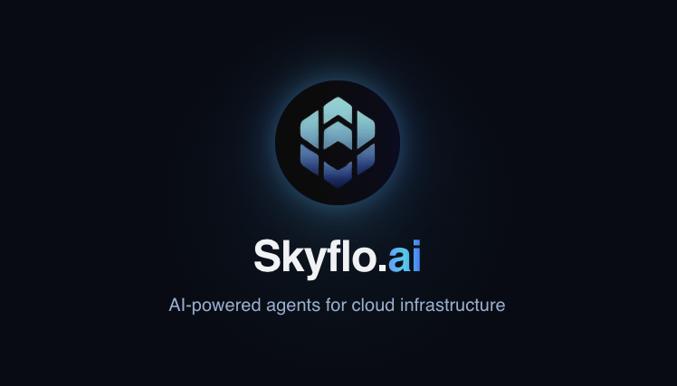

<p align="center">
  
</p>

<div align="center">

  [](https://skyflo.ai)
  [](https://discord.gg/kCFNavMund)
  [](https://x.com/skyflo_ai)
  [](https://www.youtube.com/@SkyfloAI)
</div>

## AI-powered Agents for Cloud Infrastructure

Skyflo.ai democratizes cloud operations through AI-powered agents that enable natural language interaction with AWS and Kubernetes. Our mission is to make infrastructure management accessible through conversational AI while maintaining enterprise-grade security and compliance.

> **Open Core Philosophy**: The core functionality and intelligence behind Skyflo.ai is open source. We follow an open-core model with free community edition and premium enterprise extensions.

## Features

- **Natural Language Cloud Management**: Interact with AWS and Kubernetes using natural language
- **Cloud Cost Optimization**: Monitor and optimize cloud costs automatically
- **Resource Discovery**: Automatic discovery and visualization of cloud resources
- **Real-time Q&A**: Get immediate answers about your infrastructure
- **Secure by Design**: SOC2-compliant with secure agent-based architecture

## Getting Started

### Prerequisites

- For AWS: AWS CLI with AdministratorAccess
- For Kubernetes: kubectl with admin permissions
- Bash or compatible shell environment

### Quick Installation

```bash
# Install AWS agent
curl -sSL https://download.skyflo.ai/install.sh | bash -s -- --aws

# Install Kubernetes agent
curl -sSL https://download.skyflo.ai/install.sh | bash -s -- --k8s
```

For advanced configurations and security considerations, visit our [Installation Guide](https://docs.skyflo.ai/installation).

## Usage Examples

```
# AWS - Create an EC2 instance
"Create a t3.medium EC2 instance in us-west-2 with the latest Amazon Linux AMI"

# AWS - Check costs
"Show me underutilized EC2 instances and recommend right-sizing options"

# Kubernetes - Scale a deployment
"Scale the frontend deployment in production to 5 replicas"

# Kubernetes - Troubleshooting
"Help me debug why the authentication service keeps crashing"
```

For more examples, see our [Usage Guide](https://docs.skyflo.ai/usage).

## Project Structure

Skyflo.ai follows a modular approach with multiple repositories:

| Repository | Purpose |
|---|---|
| [**skyflo**](https://github.com/skyflo-ai/skyflo) | Main entry point |
| [**engine**](https://github.com/skyflo-ai/engine) | Core intelligence |
| [**api**](https://github.com/skyflo-ai/api) | Backend server |
| [**frontend**](https://github.com/skyflo-ai/frontend) | User interface |
| [**k8s-agent**](https://github.com/skyflo-ai/k8s-agent) | K8s resources |
| [**aws-agent**](https://github.com/skyflo-ai/aws-agent) | AWS resources |

## Documentation

- [Official Documentation](https://docs.skyflo.ai)
- [Architecture](docs/architecture.md)
- [API Reference](docs/api.md)

## Contributing

We welcome contributions! See our [Contributing Guide](CONTRIBUTING.md) for details on getting started.

- [Development Setup](https://docs.skyflo.ai/development)
- [Good First Issues](https://github.com/skyflo-ai/skyflo/labels/good%20first%20issue)

## Project Status

| Phase | Timeline | Status |
|----|----|----|
| **Foundation** | Q4 2024 | ✅ Completed |
| **Open Source Launch** | Q1 2025 | 🔄 In Progress |
| **Community Growth** | Q1 2025 | 🔄 In Progress |
| **Enterprise Development** | Q1/Q2 2025 | 🔄 In Progress |
| **Expansion** | Q3 2025 | 📅 Planned |

## Community

- [Discord](https://discord.gg/kCFNavMund)
- [Twitter/X](https://x.com/skyflo_ai)
- [YouTube](https://www.youtube.com/@SkyfloAI)
- [GitHub Discussions](https://github.com/skyflo-ai/skyflo/discussions)