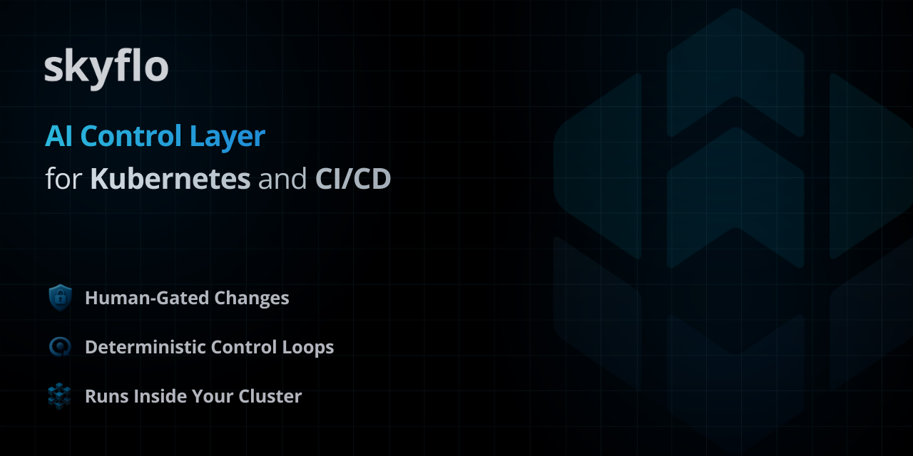

<p align="center">
  <a href="https://skyflo.ai">
    
  </a>
</p>

<h3 align="center">Self-Hosted AI Control Layer for Kubernetes & CI/CD</h3>

<p align="center">
  <a href="https://github.com/skyflo-ai/skyflo/actions">
    
  </a>&nbsp;
  <a href="https://github.com/skyflo-ai/skyflo/releases">
    
  </a>&nbsp;
  <a href="https://github.com/skyflo-ai/skyflo/blob/main/LICENSE">
    
  </a>
</p>

<p align="center">
  <a href="https://skyflo.ai">Website</a> ·
  <a href="docs/install.md">Installation</a> ·
  <a href="docs/architecture.md">Architecture</a> ·
  <a href="https://discord.gg/kCFNavMund">Discord</a>
</p>

---

Skyflo is a **self-hosted AI operations agent** for **Kubernetes and CI/CD** with **native Jenkins support**. It turns natural language into **typed, auditable tool execution**, enforced by an **approval gate for every mutating operation**.

Skyflo is not a CLI wrapper, not an autonomous mutation bot, and not a GitOps control plane. It is an **in-cluster execution runtime** that enforces deterministic control before anything changes in production.

---

### Quick Start

Install Skyflo inside your Kubernetes cluster:

```bash
curl -fsSL https://skyflo.ai/install.sh | bash
```

Bring your own LLM (OpenAI, Anthropic, Gemini, Groq, self-hosted). See [docs/install.md](docs/install.md).

---

### Execution Model

Skyflo enforces a strict loop for every infrastructure change:

1. **Plan**: generate a concrete, replayable plan
2. **Approve**: explicit approval for every mutating tool call
3. **Execute**: run typed tools via MCP (Kubernetes, Helm, Argo Rollouts, Jenkins)
4. **Verify**: validate state against the declared intent
5. **Persist**: store tool-level audit history

No blind `kubectl apply`. No silent automation. No untracked changes.

---

### Safety Properties

* Approval gate for every mutating operation
* Typed tool execution (schema-validated inputs)
* Persisted audit trail with tool results
* Replayable control loop (plan → approve → execute → verify)
* Runs inside your cluster (data stays in your environment)
* No outbound data to Skyflo servers
* LLM-agnostic (no vendor lock-in)

---

### Supported Tools

| Tool              | Capabilities                                                                     |
| ----------------- | -------------------------------------------------------------------------------- |
| **Kubernetes**    | discovery, get/describe, logs/exec, diff-first apply, rollout history, rollbacks |
| **Helm**          | template, install/upgrade/rollback, dry-run, diff-first safety                   |
| **Argo Rollouts** | status, pause/resume, promote/cancel, progressive delivery control               |
| **Jenkins**       | jobs/builds/logs, parameters, SCM context, build control                         |

All mutating operations require explicit approval.

---

### Demo

<p align="center">
  
</p>

Deterministic plans. Explicit approval. Verified execution.

---

### Comparison

| Capability                    | CLI Assistants | Autonomous Agents | GitOps Platforms | **Skyflo** |
| ----------------------------- | -------------: | ----------------: | ---------------: | ---------: |
| Natural language ops          |            Yes |               Yes |          Limited |        Yes |
| Mandatory mutation approval   |       Optional |                No |         PR-based |        Yes |
| Deterministic control loop    |             No |                No |          Partial |        Yes |
| Kubernetes + CI unified       |             No |           Partial |               No |        Yes |
| In-cluster deployment         |        Partial |           Partial |           Varies |        Yes |
| Team RBAC + audit             |             No |           Limited |              Yes |        Yes |
| Real-time execution streaming |             No |                No |               No |        Yes |

---

### System Architecture

| Component                | Description                                                                  |
| ------------------------ | ---------------------------------------------------------------------------- |
| [**Engine**](engine)     | LangGraph workflow: planner, approval gate, verifier, persistence, auth/RBAC |
| [**MCP Server**](mcp)    | Typed tools for Kubernetes, Helm, Argo Rollouts, Jenkins                     |
| [**Command Center**](ui) | Next.js UI with real-time streaming, approvals, team admin                   |

Details: [docs/architecture.md](docs/architecture.md)

---

### Contributing

Apache 2.0 OSS. High-signal contributions welcome. See [CONTRIBUTING.md](CONTRIBUTING.md).

---

### License

Apache 2.0. See [LICENSE](LICENSE).

---

### Community

<p>
  <a href="https://skyflo.ai">Website</a> ·
  <a href="https://discord.gg/kCFNavMund">Discord</a> ·
  <a href="https://x.com/skyflo_ai">X</a> ·
  <a href="https://www.linkedin.com/company/skyflo">LinkedIn</a>
</p>