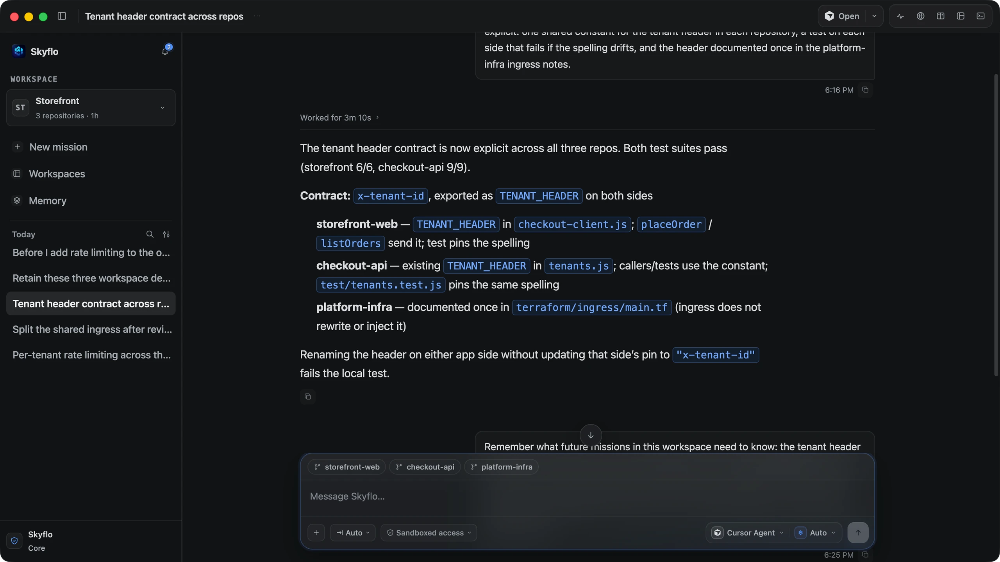

  

# Skyflo

### The control plane for agentic engineering.

Coordinate **Codex, Claude Code, Cursor Agent, and your own agents** across repositories, from an approved plan to an independently reviewed result.

Skyflo Desktop brings your agents, models, code, browser, and terminal into one durable mission. Define the objective, approve the plan, and let specialists work within the boundaries you set. Keep the decisions, work, and review attached to the mission as it progresses.

**[Download for Mac](https://skyflo.ai/download)** · [See a mission run](https://skyflo.ai/missions) · [Desktop guide](https://skyflo.ai/support)

macOS 14+. Apple silicon and Intel.

> [!NOTE]
> **About this repository:** This is the deprecated open source Kubernetes agent. The current Skyflo Desktop product is separate, proprietary software. Read the [deprecation notice](DEPRECATION.md) for existing-deployment guidance. The [legacy project reference](LEGACY.md) preserves the previous documentation.

  

## Give the whole objective to one mission

Engineering work often crosses a boundary: an API changes, its clients need updating, and the infrastructure configuration must agree. Skyflo holds that work together across repositories, with a plan, scoped specialists, and a review of the result.

| What you need | What Skyflo gives you |
| --- | --- |
| Your preferred coding agents | Run Codex, Claude Code, Cursor Agent, and other supported agents inside a Skyflo mission. |
| Changes across repositories | Coordinate registered repositories around one objective and shared mission context. |
| Control over implementation | Approve the plan, set the mission's authority, and let coder specialists work in isolated Git worktrees. |
| A separate review of the work | A read-only reviewer examines the result without making implementation changes. |
| Continuity across sessions | Keep the mission's state, decisions, approvals, and record available when you return. |
| Useful context for the next mission | Carry source-linked memory forward, correct or remove it, and reuse proven workflows as Skills. |

## Your Mac, your projects, your model access

Execution stays on your linked Mac. Use your own model keys or supported provider accounts; BYOK credentials stay in the macOS Keychain. Browser and terminal work stay attached to the same mission as the code.

[Explore how Skyflo works](https://skyflo.ai/how-it-works) · [Compare plans](https://skyflo.ai/pricing)

## Skyflo learns between missions

Skyflo is a **HyperAgent**: it learns from completed missions, carries what they teach into future work, and turns workflows that prove themselves into reusable Skills. It can change how it routes work inside boundaries it cannot change. You can review and undo what it learns.

[Explore memory and learning](https://skyflo.ai/knowledge)

## Start with a real engineering objective

Bring the repositories and agents you already use. Give Skyflo a mission that crosses them, review the plan, and follow the work through implementation and independent review.

**[Get Skyflo Desktop](https://skyflo.ai/download)** · [Contact Skyflo](https://skyflo.ai/contact)

## Legacy Kubernetes agent

The open source agent previously developed in this repository is deprecated. Its code and deployment assets remain available for existing operators and reference. Deprecation does not alter running deployments or provide an automatic migration to Skyflo Desktop.

- [Deprecation notice and existing-deployment guidance](DEPRECATION.md)
- [Historical features, architecture, and installation instructions](LEGACY.md)
- [Legacy contribution guide](CONTRIBUTING.md)
- [Apache 2.0 license for the legacy agent](LICENSE)

[X](https://x.com/skyflo_ai) · [LinkedIn](https://www.linkedin.com/company/skyflo-ai) · [Discord](https://discord.gg/kCFNavMund)
