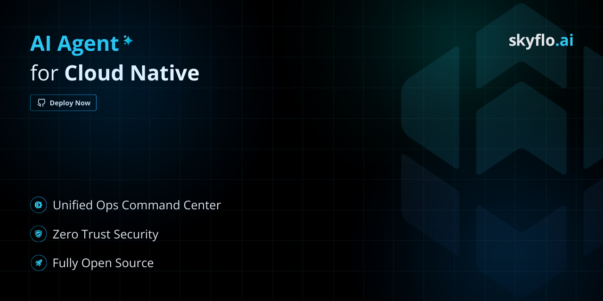

# Skyflo.ai - AI Agent for Cloud Native

<p align="center">
  
</p>

<div align="center">

  [](https://skyflo.ai)
  [](https://discord.gg/kCFNavMund)
  [](https://x.com/skyflo_ai)
  [](https://www.youtube.com/@SkyfloAI)

</div>

Skyflo.ai is your AI-powered companion for cloud native operations, enabling seamless infrastructure management through natural language.

## How to Install

Skyflo.ai offers flexible deployment options, accommodating both production and local Kubernetes environments:

```bash
export OPENAI_API_KEY='your-openai-api-key'
curl -sL https://raw.githubusercontent.com/skyflo-ai/skyflo/main/deployment/install.sh -o install.sh && chmod +x install.sh && ./install.sh
```

For more details, see the [Installation Guide](docs/install.md).

## Configuration

By default, Skyflo is configured to use OpenAI. If you wish to use a different provider (like Groq, Anthropic, Cohere, etc.), or need detailed instructions on setting API keys, selecting models, understanding model requirements, and troubleshooting, please refer to the comprehensive **[Switching LLM Models Guide](engine/docs/switching_llm_models.md)**.

## Architecture

Read more about the architecture of Skyflo.ai in the [Architecture](docs/architecture.md) documentation.

Skyflo.ai's multi-agent architecture leverages [Microsoft's AutoGen](https://github.com/microsoft/autogen) for agent orchestration and [LangGraph](https://github.com/langchain-ai/langgraph) for graph-based execution flows.

## Roadmap

Read more about the [roadmap of Skyflo.ai here](https://skyflo.ai/roadmap).

## Contributing

We welcome contributions! See our [Contributing Guide](CONTRIBUTING.md) for details on getting started.

## Code of Conduct

We have a [Code of Conduct](code_of_conduct.md) that we ask all contributors to follow.

## Community

- [Discord](https://discord.gg/kCFNavMund)
- [Twitter/X](https://x.com/skyflo_ai)
- [YouTube](https://www.youtube.com/@SkyfloAI)
- [GitHub Discussions](https://github.com/skyflo-ai/skyflo/discussions)
