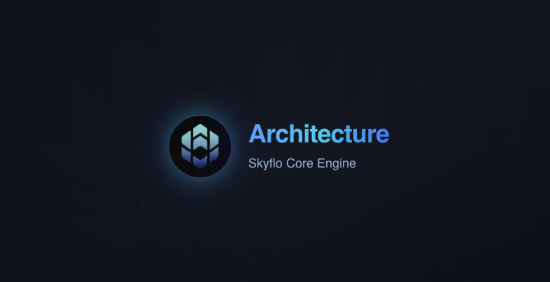
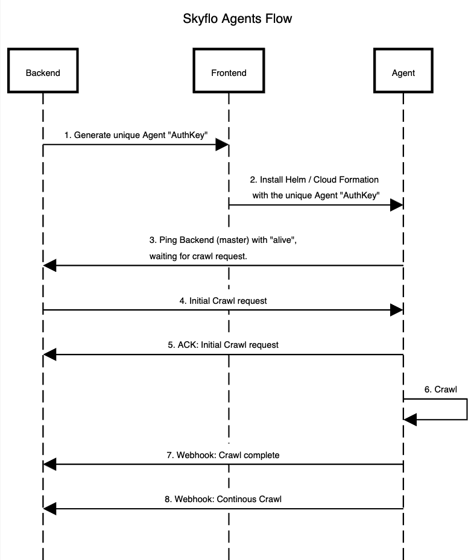

# Skyflo.ai Architecture

  

This document outlines the architecture of Skyflo.ai, a B2B SaaS product that enables the creation of secure and SOC2-compliant AI agents to automate DevOps and cloud operations.

## Overview

Skyflo.ai provides AI-powered agents for AWS and Kubernetes management, enabling:

- Natural language management of cloud resources
- Cloud cost monitoring and optimization
- Real-time Q&A about infrastructure

## Agent Architecture

Skyflo.ai operates through a secure agent-based model:

### AWS Agent Flow

1. **Account Creation**: Customer creates an account on Skyflo.ai
2. **Agent Setup**: Customer creates an AWS agent in the platform
3. **Installation**: Customer runs a provided script containing a secure AuthKey (JWT)
4. **Agent Deployment**: The script deploys two components:

   **A. Initial Crawler**
   - Assumes AdministratorAccess
   - Creates Lambda function to scan AWS resources
   - Extracts required data based on configuration
   - Sends data to Skyflo.ai backend

   **B. Real-time Watcher**
   - Sets up IAM policy for CloudTrail and EventBridge
   - Creates EventBridge rule targeting Skyflo.ai backend
   - Monitors events from specified AWS services

## API Architecture

**Base URL**: `https://api.skyflo.ai/v1`

**Authentication**: All APIs require Bearer token authentication

### Core Endpoints

1. **Agent Authentication**
   - `POST /agents/auth-key` - Creates authentication for new agent installations

2. **Agent Operations**
   - `POST /agents/{agent_id}/alive` - Agent status and initial configuration

3. **Crawl Webhooks**
   - `POST /webhooks/{provider}/{agent_id}/crawl-complete` - Initial scan results
   - `POST /webhooks/{provider}/{agent_id}/continuous-crawl` - Real-time updates

### Security Implementation

1. **Authentication**: JWT-based with short-lived tokens and 30-day rotation
2. **Validation**: Rate limiting, payload restrictions, header validation
3. **Monitoring**: Authentication logging, audit trails, performance metrics

## Technical Stack

### Backend
- Python
- Django
- GraphQL
- Temporal

### Frontend
- TypeScript
- React
- Next.js
- Tailwind CSS

### Infrastructure
- Kubernetes
- Docker
- Helm
- Terraform 