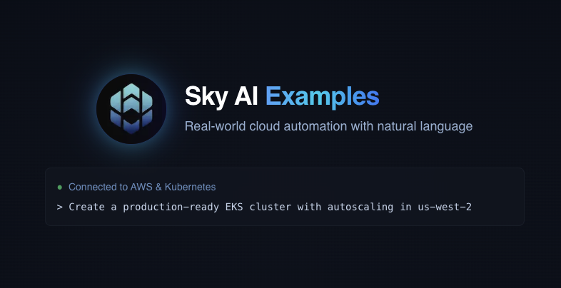

# Sky AI Examples

<div align="center">
  
</div>

## Introduction

Sky AI enables natural language interaction with your cloud infrastructure, providing a conversational interface to AWS and Kubernetes operations. This document showcases real-world examples of how Sky AI can transform your DevOps workflows through simple, natural language commands.

> **Note**: These examples showcase capabilities of Sky AI agents and are provided for illustration. The exact commands executed will be customized to your specific environment and requirements.

## Table of Contents

- [Infrastructure Management](#infrastructure-management)
- [Security & Compliance](#security--compliance)
- [Database Operations](#database-operations)
- [Monitoring & Operations](#monitoring--operations)
- [DevOps & CI/CD](#devops--cicd)
- [AI & Machine Learning](#ai--machine-learning)

## Infrastructure Management

Automate your infrastructure deployment, scaling, and management with AI assistance.

### Set up EKS Cluster with Autoscaling

**You ask:**
```
I need to create an EKS cluster with 3 node groups in us-west-2 with autoscaling enabled. Please make it production ready with proper security groups.
```

**Sky AI responds:**
```
I'll help you set up a production-ready EKS cluster with autoscaling in us-west-2, including proper networking, security groups, and node group configurations optimized for high availability and cost efficiency.
```

**Sky AI executes:**
```bash
# Create EKS Cluster
aws eks create-cluster \
  --name production-cluster \
  --region us-west-2 \
  --role-arn arn:aws:iam::123456789012:role/EKSClusterRole \
  --resources-vpc-config subnetIds=subnet-abcdef,subnet-123456,subnet-7890ab,securityGroupIds=sg-abcdef

# Configure Node Groups
aws eks create-nodegroup \
  --cluster-name production-cluster \
  --nodegroup-name standard-workers \
  --node-role arn:aws:iam::123456789012:role/EKSNodeRole \
  --subnets subnet-abcdef subnet-123456 \
  --instance-types t3.large \
  --scaling-config minSize=2,maxSize=10,desiredSize=3 \
  --region us-west-2
```

### Create S3 Bucket with Proper Policies

**You ask:**
```
Create an S3 bucket for storing logs with proper encryption, lifecycle policies, and prevent public access
```

**Sky AI responds:**
```
I'll create a secure S3 bucket for logging with encryption, lifecycle management, and no public access. Here's the comprehensive implementation.
```

**Sky AI executes:**
```bash
# Create S3 Bucket
aws s3api create-bucket \
  --bucket company-logs-bucket-2024 \
  --region us-east-1 \
  --create-bucket-configuration LocationConstraint=us-east-1

# Enable Encryption
aws s3api put-bucket-encryption \
  --bucket company-logs-bucket-2024 \
  --server-side-encryption-configuration '{
    "Rules": [
      {
        "ApplyServerSideEncryptionByDefault": {
          "SSEAlgorithm": "AES256"
        }
      }
    ]
  }'

# Block Public Access
aws s3api put-public-access-block \
  --bucket company-logs-bucket-2024 \
  --public-access-block-configuration BlockPublicAcls=true,IgnorePublicAcls=true,BlockPublicPolicy=true,RestrictPublicBuckets=true
```

### VPC with Private & Public Subnets

**You ask:**
```
Create a VPC with 3 private and 3 public subnets across 3 AZs with NAT gateway
```

**Sky AI responds:**
```
I'll set up a robust VPC architecture with public and private subnets across 3 availability zones, properly configured with a NAT gateway for outbound connectivity.
```

**Sky AI executes:**
```bash
# Create VPC
aws ec2 create-vpc \
  --cidr-block 10.0.0.0/16 \
  --tag-specifications 'ResourceType=vpc,Tags=[{Key=Name,Value=production-vpc}]'

# Create Public Subnet 1
aws ec2 create-subnet \
  --vpc-id vpc-12345678 \
  --cidr-block 10.0.0.0/24 \
  --availability-zone us-west-2a \
  --tag-specifications 'ResourceType=subnet,Tags=[{Key=Name,Value=public-subnet-1}]'
```

### Multi-Region Disaster Recovery Setup

**You ask:**
```
Set up a cross-region disaster recovery solution for our production applications with automated failover
```

**Sky AI responds:**
```
I'll help you implement a comprehensive disaster recovery solution with cross-region replication, automated health checks, and failover mechanisms.
```

**Sky AI executes:**
```bash
# Configure Route53 Health Checks
aws route53 create-health-check \
  --caller-reference $(date +%s) \
  --health-check-config '{
    "Type": "HTTPS",
    "FullyQualifiedDomainName": "api.production.com",
    "RequestInterval": 30,
    "FailureThreshold": 3,
    "MeasureLatency": true,
    "Regions": ["us-west-2", "us-east-1", "eu-west-1"]
  }'
```

## Security & Compliance

Enforce security best practices, scan for vulnerabilities, and ensure compliance.

### AWS Security Audit

**You ask:**
```
Perform a security audit on my AWS account and identify potential security issues
```

**Sky AI responds:**
```
I'll conduct a comprehensive security audit of your AWS account to identify potential vulnerabilities and compliance issues.
```

**Sky AI executes:**
```bash
# Check Exposed Access Keys
aws iam list-access-keys --output table

# Identify Public S3 Buckets
aws s3api list-buckets --query 'Buckets[].Name' --output text | xargs -I {} aws s3api get-bucket-policy-status --bucket {} --query 'PolicyStatus.IsPublic'

# Detect Unencrypted Volumes
aws ec2 describe-volumes --query 'Volumes[?Encrypted==`false`]' --output table
```

### Implement Zero Trust Architecture

**You ask:**
```
Help me implement zero trust security model across our AWS infrastructure
```

**Sky AI responds:**
```
I'll guide you through implementing a comprehensive zero trust architecture with proper network segmentation, identity-based access, and continuous verification.
```

**Sky AI executes:**
```bash
# Configure AWS IAM Identity Center
aws identitystore create-group \
  --display-name "zero-trust-admins" \
  --description "Administrators with just-in-time privileged access"
```

### SOC 2 Compliance Check

**You ask:**
```
Analyze our AWS infrastructure for SOC 2 compliance requirements
```

**Sky AI responds:**
```
I'll help you assess your infrastructure against SOC 2 requirements and implement necessary controls for compliance.
```

**Sky AI executes:**
```bash
# Enable AWS Config
aws configservice put-configuration-recorder \
  --configuration-recorder name=soc2-recorder,roleARN=arn:aws:iam::123456789012:role/service-role/config-role \
  --recording-group allSupported=true,includeGlobalResources=true
```

## Database Operations

Manage databases, optimize queries, and automate routine maintenance tasks.

### Set up Amazon Aurora with Replicas

**You ask:**
```
Create an Aurora PostgreSQL cluster with 2 read replicas across multiple AZs
```

**Sky AI responds:**
```
I'll help you set up a highly available Aurora PostgreSQL cluster with read replicas distributed across different availability zones.
```

**Sky AI executes:**
```bash
# Create DB Subnet Group
aws rds create-db-subnet-group \
  --db-subnet-group-name aurora-subnet-group \
  --db-subnet-group-description "Subnet group for Aurora cluster" \
  --subnet-ids subnet-abc123 subnet-def456 subnet-ghi789

# Create Aurora Cluster
aws rds create-db-cluster \
  --db-cluster-identifier production-postgres \
  --engine aurora-postgresql \
  --engine-version 13.6 \
  --master-username dbadmin \
  --master-user-password REDACTED \
  --db-subnet-group-name aurora-subnet-group \
  --vpc-security-group-ids sg-abc123 \
  --backup-retention-period 7 \
  --deletion-protection \
  --storage-encrypted
```

### Database Migration with Zero Downtime

**You ask:**
```
Migrate our on-premise PostgreSQL database to RDS with minimal downtime
```

**Sky AI responds:**
```
I'll help you perform a zero-downtime migration using AWS DMS with continuous replication and automated cutover.
```

**Sky AI executes:**
```bash
# Create DMS Replication Instance
aws dms create-replication-instance \
  --replication-instance-identifier prod-migration \
  --replication-instance-class dms.r5.large \
  --allocated-storage 100 \
  --multi-az
```

### Database Performance Optimization

**You ask:**
```
Analyze and optimize our RDS instance performance
```

**Sky AI responds:**
```
I'll help you identify performance bottlenecks and implement optimizations for better database performance.
```

**Sky AI executes:**
```bash
# Enable Performance Insights
aws rds modify-db-instance \
  --db-instance-identifier production-db \
  --enable-performance-insights \
  --performance-insights-retention-period 7
```

## Monitoring & Operations

Set up comprehensive monitoring, alerting, and automated operations.

### Create Advanced CloudWatch Dashboard

**You ask:**
```
Create a CloudWatch dashboard to monitor our EC2 instances, RDS database, and API Gateway with useful metrics
```

**Sky AI responds:**
```
I'll create a comprehensive CloudWatch dashboard that gives you visibility into your EC2 instances, RDS database, and API Gateway performance.
```

**Sky AI executes:**
```bash
# Create Dashboard
aws cloudwatch put-dashboard \
  --dashboard-name "Production-Infrastructure-Overview" \
  --dashboard-body file://dashboard.json
```

### Intelligent Alerting System

**You ask:**
```
Set up smart alerts for our production environment with different severity levels and proper escalation
```

**Sky AI responds:**
```
I'll help you implement an intelligent alerting system with proper thresholds, anomaly detection, and escalation policies.
```

**Sky AI executes:**
```bash
# Create Composite Alarm
aws cloudwatch put-composite-alarm \
  --alarm-name HighSeverityProductionAlert \
  --alarm-rule "ALARM(CPUUtilization) AND ALARM(MemoryUtilization)"
```

### Cost Optimization Analysis

**You ask:**
```
Help me optimize our AWS infrastructure costs without compromising performance
```

**Sky AI responds:**
```
I'll analyze your infrastructure usage patterns and suggest cost optimizations while maintaining performance standards.
```

**Sky AI executes:**
```bash
# Generate Cost Report
aws ce get-cost-and-usage \
  --time-period Start=$(date -v-30d +%Y-%m-%d),End=$(date +%Y-%m-%d) \
  --granularity DAILY \
  --metrics "BlendedCost" "UnblendedCost" "UsageQuantity"
```

## DevOps & CI/CD

Automate development workflows, deployments, and testing processes.

### GitLab CI/CD Pipeline Setup

**You ask:**
```
Create a GitLab CI/CD pipeline for a NodeJS app with testing, building, and deployment stages to AWS
```

**Sky AI responds:**
```
I'll help you set up a comprehensive GitLab CI/CD pipeline with testing, building, and AWS deployment stages for your NodeJS application.
```

**Sky AI executes:**
```bash
# Create .gitlab-ci.yml
cat > .gitlab-ci.yml << 'EOL'
stages:
  - test
  - build
  - deploy

variables:
  AWS_REGION: us-east-1
  ECR_REPOSITORY: 123456789012.dkr.ecr.us-east-1.amazonaws.com/nodejs-app

test:
  stage: test
  image: node:16-alpine
  script:
    - npm ci
    - npm run lint
    - npm test
  cache:
    paths:
      - node_modules/

build:
  stage: build
  image: docker:20.10.16
  services:
    - docker:20.10.16-dind
  script:
    - docker build -t $ECR_REPOSITORY:$CI_COMMIT_SHORT_SHA .
    - aws ecr get-login-password | docker login --username AWS --password-stdin $ECR_REPOSITORY
    - docker push $ECR_REPOSITORY:$CI_COMMIT_SHORT_SHA
  only:
    - main
    - staging

deploy:
  stage: deploy
  image: alpine:3.15
  script:
    - aws eks update-kubeconfig --region $AWS_REGION --name production-cluster
    - kubectl set image deployment/nodejs-app nodejs-app=$ECR_REPOSITORY:$CI_COMMIT_SHORT_SHA
    - kubectl rollout status deployment/nodejs-app
  only:
    - main
EOL
```

### Blue-Green Deployment Strategy

**You ask:**
```
Implement blue-green deployment for our microservices architecture
```

**Sky AI responds:**
```
I'll help you set up a sophisticated blue-green deployment strategy with automated health checks and rollback capabilities.
```

**Sky AI executes:**
```bash
# Create Route53 Traffic Policy
aws route53 create-traffic-policy \
  --name blue-green-policy \
  --document file://traffic-policy.json
```

### GitOps Infrastructure Setup

**You ask:**
```
Set up GitOps workflow with ArgoCD for our Kubernetes clusters
```

**Sky AI responds:**
```
I'll help you implement a GitOps workflow using ArgoCD for automated, git-based infrastructure management.
```

**Sky AI executes:**
```bash
# Install ArgoCD
kubectl create namespace argocd
kubectl apply -n argocd -f https://raw.githubusercontent.com/argoproj/argo-cd/stable/manifests/install.yaml
```

## AI & Machine Learning

Integrate AI capabilities into your cloud infrastructure and applications.

### Deploy ML Model with SageMaker

**You ask:**
```
Deploy a pretrained sentiment analysis model using Amazon SageMaker with autoscaling
```

**Sky AI responds:**
```
I'll help you deploy a pretrained sentiment analysis model on Amazon SageMaker with autoscaling capabilities for production workloads.
```

**Sky AI executes:**
```bash
# Create SageMaker Model
aws sagemaker create-model \
  --model-name sentiment-analysis-model \
  --primary-container '{
    "Image": "123456789012.dkr.ecr.us-east-1.amazonaws.com/sentiment-analysis:latest",
    "ModelDataUrl": "s3://my-ml-models/sentiment-analysis/model.tar.gz"
  }' \
  --execution-role-arn arn:aws:iam::123456789012:role/SageMakerExecutionRole

# Create Endpoint Configuration
aws sagemaker create-endpoint-config \
  --endpoint-config-name sentiment-analysis-config \
  --production-variants '{
    "VariantName": "default",
    "ModelName": "sentiment-analysis-model",
    "InitialInstanceCount": 1,
    "InstanceType": "ml.m5.large",
    "AutoScalingPolicy": {
      "MinCapacity": 1,
      "MaxCapacity": 5
    }
  }'
```

### MLOps Pipeline Setup

**You ask:**
```
Create an automated ML pipeline for model training and deployment
```

**Sky AI responds:**
```
I'll help you set up an end-to-end MLOps pipeline with automated training, validation, and deployment stages.
```

**Sky AI executes:**
```bash
# Create Step Functions Workflow
aws stepfunctions create-state-machine \
  --name ml-training-pipeline \
  --definition file://ml-workflow.json \
  --role-arn arn:aws:iam::123456789012:role/StepFunctionsMLWorkflowRole
```

### Real-time AI Inference API

**You ask:**
```
Set up a real-time inference API for our computer vision model
```

**Sky AI responds:**
```
I'll help you deploy a scalable real-time inference API using SageMaker endpoints and API Gateway.
```

**Sky AI executes:**
```bash
# Create API Gateway
aws apigateway create-rest-api \
  --name vision-inference-api \
  --description "Real-time computer vision inference API"
```

## Enterprise Features

The examples above showcase the core capabilities of Sky AI. Our enterprise version extends these capabilities with:

- **Multi-cloud management** across AWS, Azure, GCP, and more
- **Advanced compliance tools** for SOC2, HIPAA, and PCI DSS
- **Custom AI agents** tailored to your organization's unique needs
- **Enterprise-grade support** with guaranteed SLAs

[Contact us](mailto:contact@skyflo.ai) to learn more about our enterprise offerings.

---

<div align="center">
  <p>Built with ❤️ by the Skyflo.ai team</p>
  <a href="https://discord.gg/kCFNavMund">Discord</a> • 
  <a href="https://x.com/skyflo_ai">Twitter/X</a> • 
  <a href="https://www.youtube.com/@SkyfloAI">YouTube</a>
</div>
